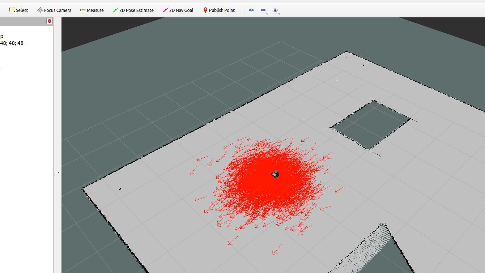

<!-- # Tutorial 2: SMACH middleware

The objective of this tutorial is to create a module that make an abstraction from the ROS navigation stack, so the use of it is simplified within a state machine.

> **Tutorial goals:**
> - Learn about the navigation stack
> - Use the `MoveBaseClient` service
> - Create an Object Oriented "skill"


`MoveBaseClient` 


```python
import rospy
from ... import MoveBaseClient
...


class BaseSkill(object):
    def __init__(self, **kwargs):
        pass
``` -->

# Tutorial 2: Creating a Middleware between the Navigation Stack and SMACH using MoveBaseClient

## Objective
In this tutorial, we aim to create a middleware that interfaces between the navigation stack and SMACH (a library for creating state machines in ROS) using the MoveBaseClient. The MoveBaseClient serves as a bridge between your state machine's high-level actions and the low-level navigation functionality provided by the navigation stack in ROS. By completing this tutorial, you will understand how to integrate ROS navigation capabilities with state machines for autonomous robot navigation tasks.


> ## Main Goals
>- Understand the role of the navigation stack in ROS.
>- Learn how to utilize the MoveBaseClient to send navigation goals.
>- Implement a middleware that allows SMACH to control robot navigation using the MoveBaseClient.

## Background: Navigation Stack and MoveBaseClient
The navigation stack in ROS is a collection of packages that enable a robot to autonomously navigate through an environment. It consists of various components such as localization, mapping, and path planning. The MoveBaseClient is an action client that communicates with the move_base node, which is the core of the navigation stack. It sends navigation goals to the move_base node, which then plans and executes the robot's movement to reach the goal.


[](https://www.youtube.com/watch?v=1aX7NFvKehs "ROS Navigation stack Architecture in 4 minutes || A to Z Basics")


## Previous to programming
Start the simulation and in another terminal, run the navigation stack:

```bash
roslaunch move_base_navigation navigation.launch
```

In another terminal, open RViz, a tool for robotic visualization.

```bash
roslaunch kobuki_bringup rviz.launch
```

You should see another window pop up with the robot model, a visualization of the LiDAR scan, a 2D Ocuppancy grid map and other information. The image below shows an example. The red arrows represent the uncertainty on the pose estimate of the robot. At star time, the uncertainty is because the robot has not collected any data samples that allows to localize itself. As you move around this array will decrease in size and the robot will be localized.




A simple way to align the robot inside the map in RViz is to use the `2D Pose Estimate` tool in the top bar. you can give an approximate pose until the LiDAR scan matches with the map.


Now, you can test the autonous navigation capabilities of the robot! Using the `2D Nav Goal` tool, select a random pose (that makes sense) inside the map and watch the robot go!

---

## The task

Moving the robot within RViz is pretty cool, but in reality is not very practical. We want to be able to send goals from our own scripts so that the robot can really be autonomous.

We have provided a Python script with a basic implementation of the [MoveBase class](https://wiki.ros.org/navigation/Tutorials/SendingSimpleGoals), which includes functionality for setting navigation goals and sending them using the MoveBaseClient. Your task is to complete certain parts of the code to make it fully functional.

### Code Snippet:
```python
# Import necessary ROS and actionlib libraries
import rospy
import actionlib
from move_base_msgs.msg import MoveBaseAction, MoveBaseGoal
from nav_msgs.msg import Odometry
from geometry_msgs.msg import Quaternion, Twist, PoseWithCovarianceStamped
from tf.transformations import quaternion_from_euler, euler_from_quaternion
import numpy as np

class BaseSkill(object):
    def __init__(self):
        # Initialize variables and subscribers
        self._target_pose = self
        self._robot_pose  = self
        self._mba_client  = None
        self.odom_topic = '/amcl_pose'
        self.cmd_vel_topic = '/p3dx/cmd_vel'
        self._odom_sub    = rospy.Subscriber(self.odom_topic, PoseWithCovarianceStamped, self.odom_cb)
        self._cmd_vel_pub = None
        rospy.sleep(.5)
        self.check()
    
    # Other methods...
```

## Instructions
1. **Understanding the Code**: Before proceeding, make sure you understand the provided code structure and its purpose. Familiarize yourself with the functions and variables defined in the MoveBase class.

2. **Completing the Middleware Functionality**:
   - Complete the `get_robot_pose()` method to return the robot pose as a list $(x, y, \theta)$. 
   
   - Complete the `_yaw_from_quat()` method to calculate the yaw angle (rotation around the z-axis) from the given quaternion orientation.

   - Check the `go()` method, and complete the implementation to send the navigation goal to the move_base node using the MoveBaseClient within the `_call_mba_client()` method.

   - Complete the `rotate()` method to rotate the robot to a certain angle around the z-axis.

3. **Testing**:
   - Run the simulation
   - Run the provided script after completing the necessary parts. Try using different targets and testing all the programmed methods. Test the functionality by setting navigation goals using the `rotate()` method or by setting custom target poses and calling the `go()` method.

```bash
rosrun homebreaker_tutorial base_skill_template.py
```


## Summary
In this tutorial, you learned about the navigation stack in ROS and its role in enabling autonomous robot navigation. You also implemented a middleware using the MoveBaseClient to interface between the navigation stack and SMACH, allowing high-level control of robot navigation tasks. By completing this tutorial, you have gained valuable experience in integrating ROS navigation capabilities with state machines for building complex robot behaviors.